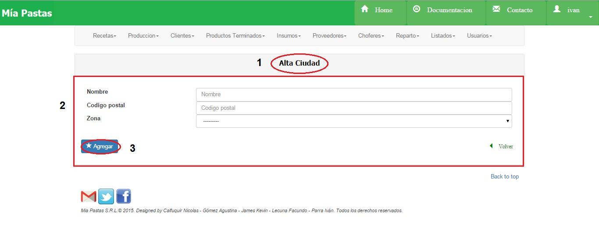
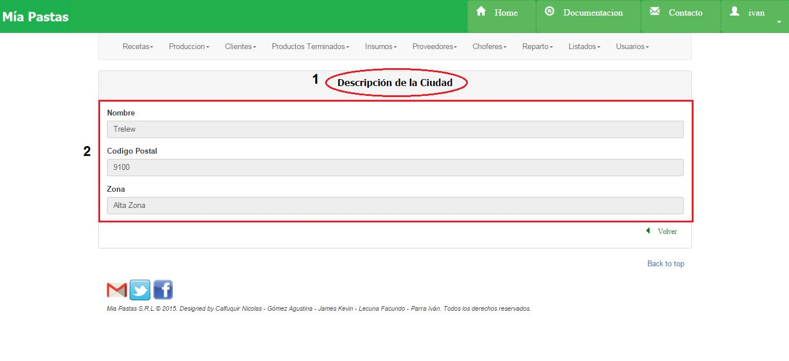
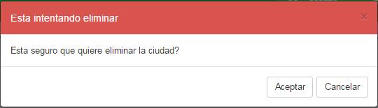

Ciudades
====================================

1.	Nombre de la sección donde estamos ubicados.
2.	Es el sector de filtrado, se podrá filtrar por nombre, código postal, zona. Se filtrará presionando el botón (3).
4.	Área de resultado del filtro donde se mostrará nombre, código postal y zona de las ciudades filtradas. De no haberse realizado ningún filtro mostrará todos los clientes existentes. Al hacer click en Zona mostrará todos los datos de la zona asociada. 
5.	El icono de lupa sirve para mostrar más detalle sobre el ítem seleccionado como se muestra en la siguiente figura. De no seleccionar previamente un ítem aparecerá un mensaje de error.
6.	El icono de llave sirve para realizar una modificación sobre el ítem seleccionado. Para esto se deberá hacer click previamente sobre el ítem deseado. De no seleccionar previamente un ítem aparecerá un mensaje de error.
7.	Eliminar una ciudad.
8.	Dar de Alta una nueva ciudad

Consultar Ciudades
-------------------
Seleccionar una ciudad click sobre el deseado y sobre el ícono de lupa.

(1) Nombre de la sección en la que nos ubicamos, (2) descripción de la ciudad consultada.

Modificar Ciudades
----------------
Seleccionar con un click la ciudad a modificar, luego hacer click sobre el ícono de modificar.

.. image:: _static/ciudades/ciudades_modificar.jpg

(1) Nombre de la sección en la que nos ubicamos, (2) descripción de la ciudad a modificar, (3)  guardar los cambios de la ciudad.

Alta Ciudad
-----------

(1) Nombre de la sección en la que nos ubicamos, (2) datos de la ciudad a crear, (3) confirmar el alta de nueva ciudad.

Eliminar Ciudades
-------------------

Seleccionar con click una ciudad y hacer click sobre el botón de eliminar. Aparecerá el siguiente cartel:

La ciudad no deberá tener clientes asociados

.. toctree::
   :maxdepth: 1
   
   ciudades consultar
   ciudades alta
   ciudades modificar
   ciudades eliminar

.. automodule:: ciudad.models
   :members: