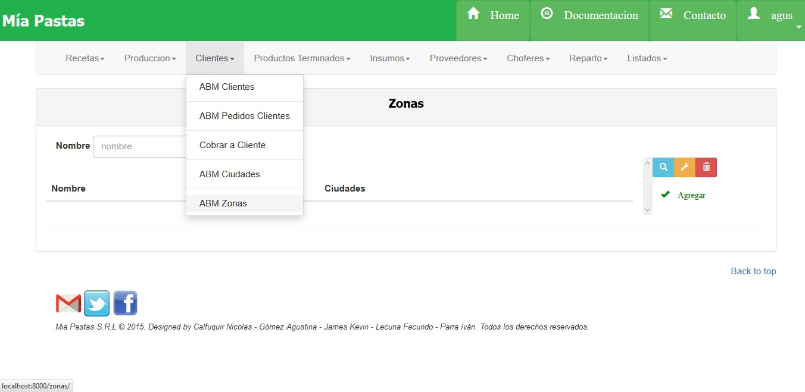
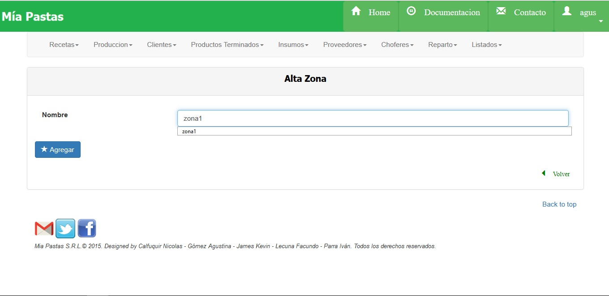

Zonas
====================================

1.	Nombre de la sección donde estamos ubicados.
2.	Es el sector de filtrado, se podrá filtrar por nombre. Se filtrará presionando el botón (3).
4.	Área de resultado del filtro donde se mostrará nombre de zona y ciudades asociadas. De no haberse realizado ningún filtro mostrará todas las zonas existentes. 
5.	El icono de lupa sirve para mostrar más detalle sobre el ítem seleccionado como se muestra en la siguiente figura. De no seleccionar previamente un ítem aparecerá un mensaje de error.
6.	El icono de llave sirve para realizar una modificación sobre el ítem seleccionado. Para esto se deberá hacer click previamente sobre el ítem deseado. De no seleccionar previamente un ítem aparecerá un mensaje de error. Mostrará la siguiente pantalla:
7.	Eliminar una zona, 
8.	Este botón permite abrir el formulario para dar de Alta una Nueva Zona.

Consulta de Zonas
-----------------
.. image:: _static/zonas/zona_consultar.jpg

(1) Nombre de la sección en la que nos ubicamos, (2) nombre de la zona, (3)  ciudades de zona.

Modificar Zona
--------------
.. image:: _static/zonas/zona_modificar.jpg

(1) Nombre de la sección en la que nos ubicamos, (2) nombre de la zona a modificar, (3)  guardar los cambios de la zona.

Eliminar una Zona
-----------------
Al hacer click aparece el siguiente cartel:

.. image:: _static/zonas/zona_eliminar.jpg

*	Observaciones:
	No se podrá dar de baja a una zona que tenga ciudades asignadas.

Dar de Alta una Zona
--------------------

(1) Nombre de la sección en la que nos ubicamos, (2) datos de la Zona a crear, (3) confirmar el alta de nueva zona.
*	Observaciones:
	No se podrá dar de alta una zona que ya exista.

.. toctree::
   :maxdepth: 2
   
   zonas consultar
   zonas alta
   zonas modificar
   zonas eliminar

