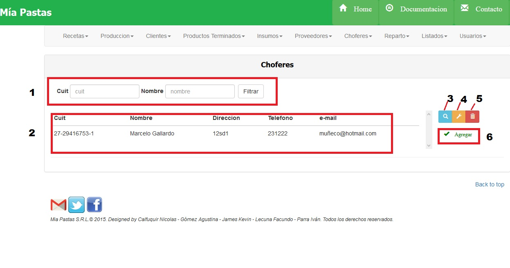
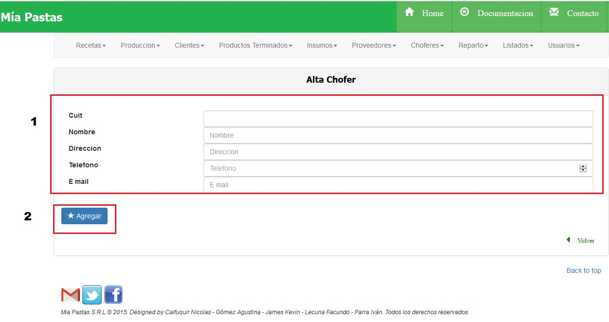

Choferes
====================================

1.	Es el sector de filtrado, se podrá filtrar por cuit o por nombre del chofer.
2.	Área de resultado del filtro donde se mostrará cuit, nombre, dirección, teléfono y e-mail, de no haberse realizado ningún filtro mostrará todos los choferes.
3.	El icono de lupa sirve para mostrar más detalle sobre el ítem seleccionado como se muestra en la siguiente figura (1), para volver a la pantalla anterior se deberá hacer click sobre volver (2). De no seleccionar previamente un ítem aparecerá un mensaje de error.
4.	El icono de llave sirve para realizar una modificación sobre el ítem seleccionado. Para esto se deberá hacer click previamente sobre el chofer deseado. De no seleccionar previamente un ítem aparecerá un mensaje de error.
5.	El icono del tacho de basura (2) sirve para eliminar un elemento seleccionado. Para esto se deberá hacer click previamente sobre el ítem que se desea eliminar (1). De no seleccionar previamente un ítem aparecerá un mensaje de error.

Consultar Choferes
-------------------
Seleccionar un chofer haciendo click sobre el deseado y sobre el ícono de lupa.

.. image:: _static/choferes/chofer_detalle.jpg

(1) Nombre de la sección en la que nos ubicamos, (2) descripción del chofer consultado.

Modificar Chofer
----------------
Seleccionar con un click el chofer a modificar, luego hacer click sobre el ícono de modificar.

.. image:: _static/choferes/chofer_modificar.jpg

La sección (1) se corresponde al área de modificación, será obligatorio completar los campos nombre y cuit. En la sección (2) se encuentra el botón de aceptar para guardar los cambios.

Alta Chofer
-----------

(1) Nombre de la sección en la que nos ubicamos, (2) datos del chofer a crear, (3) confirmar alta nuevo chofer.

Eliminar Choferes
-------------------

Seleccionar con click un chofer y hacer click sobre el botón de eliminar. Aparecerá el siguiente cartel:

.. image:: _static/choferes/chofer_eliminar.jpg

El chofer no deberá tener hojas de ruta vigentes asociadas

.. toctree::
   :maxdepth: 2
   
   choferes consultar
   choferes alta
   choferes modificar
   choferes eliminar

