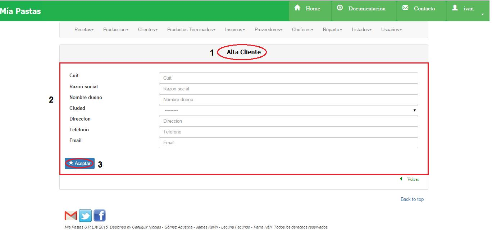

Alta Cliente
====================================
Dede la pantalla de inicio de Clientes se deberá hacer click al boton Agregar. Previo a esto se deberá contar con ciudades cargadas en zonas.
No se podrá dar de alta un cliente que ya exista, esto quiere decir que exista cuit y razón social.

(1) Nombre de la sección en la que nos ubicamos, (2) datos del cliente a crear, (3) dar de alta al nuevo cliente.

*	Observaciones
---------------------
Para dar de alta un chofer se deberá tener la ciudad y zona cargadas.