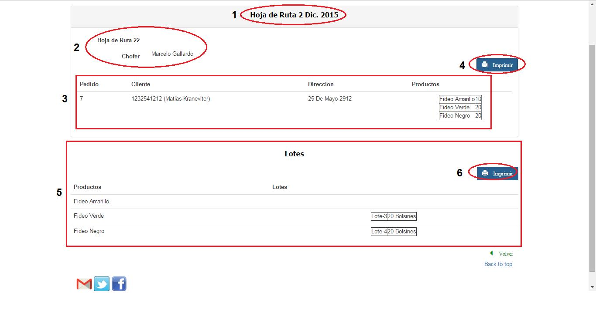
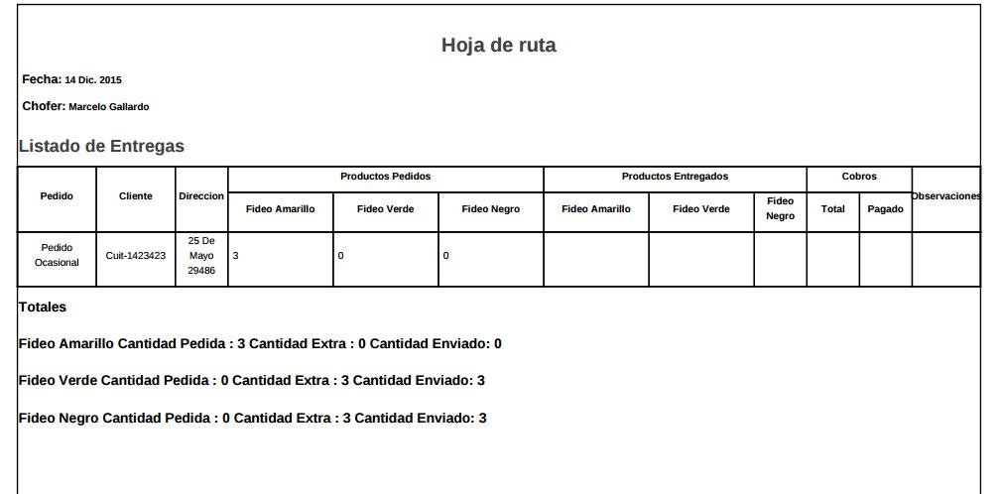

Previsualizar Hoja de Ruta
====================================

En (1) vemos la fecha de generación de la Hoja de Ruta. En (2) vemos el número de hoja de ruta y el chofer asignado. En (3) vemos todos los pedidos asignados a la hoja de ruta, mostrando para cada uno: el número de pedido, el nombre del cliente, la dirección, y un listado de todos los productos a llevar. 
Si presionamos el botón (4) se generará un archivo PDF que contendrá todos los datos de la hoja de ruta necesarios para que el chofer haga el reparto:

Hoja a PDF
-----------------------

En (5) se mostrarán todos los productos terminados asignados a la hoja de ruta, junto a los lotes de donde se sacaron dichos productos. Si presionamos el botón (6), se generará otro archivo PDF que contendrá los datos anteriormente mencionados:

.. image:: _static/hoja_ruta/hoja_lotes_pdf.jpg

