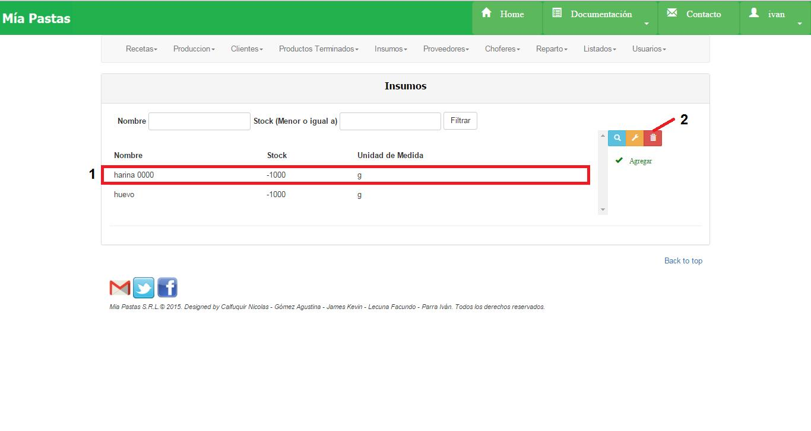

Eliminar Insumo
====================================

En (1) vemos la sección donde estamos ubicados. La sección (2) se corresponde al área de modificación, será obligatorio completar los campos que posean un asterisco (*). En la sección (3) se encuentra el botón de aceptar para guardar los cambios.

*	Observaciones:
	No se podrá eliminar un insumo que esté asociado a un pedido vigente a un proveedor.
	No se podrá eliminar un insumo que esté asociado a una receta.

