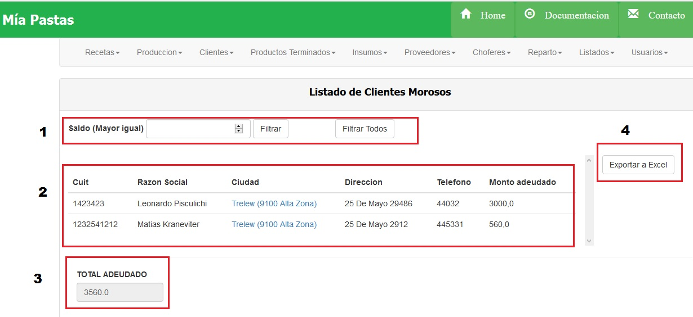
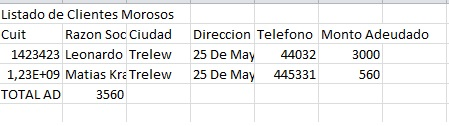

Listado de Clientes Morosos
===========================

En (1) vemos la sección donde nos encontramos. En (2) vemos la sección de filtrados, podemos filtrar por saldo, presionando luego el botón “filtrar”. Si presionamos el botón “Filtrar Todos”, mostrará todos los clientes morosos que haya.
En la sección (3) veremos la sección de resultados del filtrado. Se mostrarán todos los clientes morosos filtrados, con los siguientes datos: cuit, razón social, ciudad, dirección, teléfono y monto adeudado.
La sección (4) muestra la suma total de lo adeudado de todos los clientes filtrados.
El botón (5) que dice “Exportar”, permitirá exportar dicha grilla a un archivo de extensión .xls, el cual se puede abrir con programas como Excel:

Excel de Clientes Morosos
--------------------------

