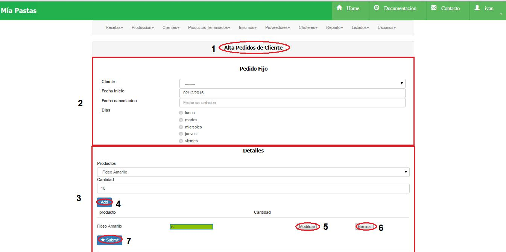

Altas de Pedidos de Clientes
====================================

*	Pedido fijo

(1) Nombre de la sección en la que nos ubicamos, (2) datos del cliente a asignarle el pedido, fecha de inicio del pedido, fecha de cancelación en caso de ser por determinado periodo, días en los que se entregará el pedido, (3) detalle del producto a agregar, (4) el botón de confirmación, listado de todos los productos agregados con la cantidad, (5) botón para modificar la cantidad,  (6) botón para eliminar ese producto, (7) botón de confirmación.

*	Pedido ocasional

.. image:: _static/pedidos_clientes/pedido_ocasional_alta.jpg

(1) Nombre de la sección en la que nos ubicamos, (2) datos del cliente a asignarle el pedido, fecha de entrega, (3) sección de detalles de los productos, (4) detalle del producto a agregar, con el botón de confirmación, listado de todos los productos agregados con la cantidad, (5)  botón para modificar la cantidad, (6)botón para eliminar ese producto, (7) botón de confirmación.

*	Pedido cambio

.. image:: _static/pedidos_clientes/pedido_cambio_alta.jpg

(1) Nombre de la sección en la que nos ubicamos, (2) datos del cliente a asignarle el pedido, fecha de entrega, (3) sección de detalles de los productos, (4) detalle del producto a agregar, con el botón de confirmación, listado de todos los productos agregados con la cantidad, (5)  botón para modificar la cantidad, (6) botón para eliminar ese producto, (7) botón de confirmación.

*	Observaciones:
	No se podrá registrar en el pedido un producto por duplicado.
	No se podrá registrar un pedido que no tenga ningún producto.