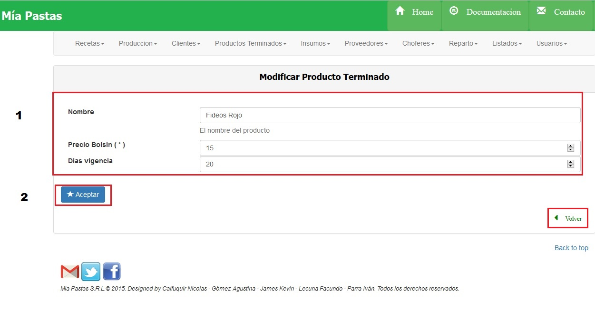
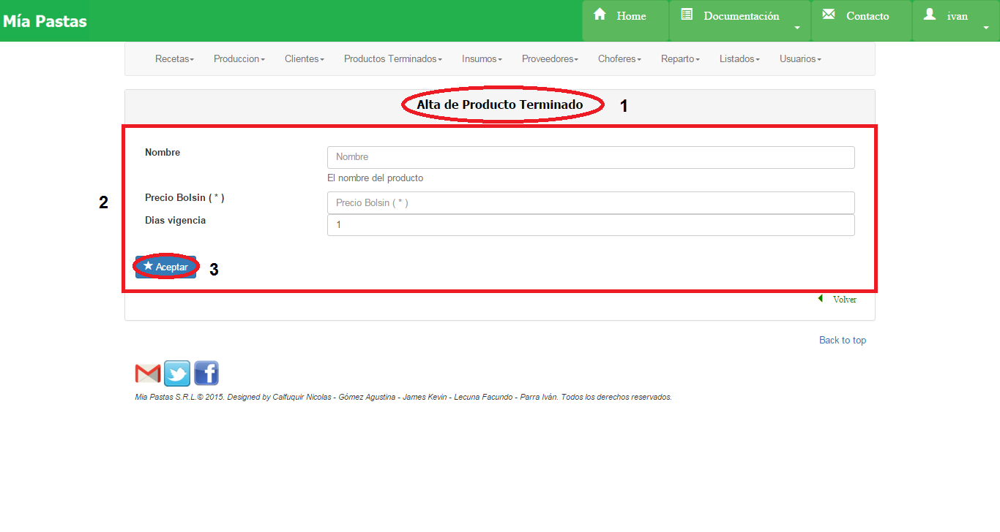

Productos Terminados
====================================

1.	Es el sector de filtrado, se podrá filtrar por nombre o cantidad de stock menor o igual al ingresado.
2.	Área de resultado del filtro donde se mostrará nombre, stock, precio y recetas asociadas al producto, de no haberse realizado ningún filtro mostrará todos los productos terminados existentes.
3.	El icono de lupa sirve para mostrar más detalle sobre el ítem seleccionado. De no seleccionar previamente un ítem aparecerá un mensaje de error.
4.	El icono de llave sirve para realizar una modificación sobre el ítem seleccionado. Para esto se deberá hacer click previamente sobre el ítem deseado. De no seleccionar previamente un ítem aparecerá un mensaje de error. 
5.      El icono del tacho de basura (2) sirve para eliminar un elemento seleccionado como se muestra en la siguiente figura. Para esto se deberá hacer click previamente sobre el ítem que se desea eliminar (1). De no seleccionar previamente un ítem aparecerá un mensaje de error.
6.	Dar de Alta un nuevo producto.

Consultar Producto Terminado
----------------------------
Seleccionar un producto haciendo click sobre el deseado y sobre el ícono de lupa.

Modificar Producto Terminado
---------------------------------------
Seleccionar con un click el producto a modificar, luego hacer click sobre el ícono de modificar.

La sección (1) se corresponde al área de modificación, será obligatorio completar los campos nombre y precio bolsín. En la sección (2) se encuentra el botón de aceptar para guardar los cambios.

Alta Producto Terminado
-----------------------

(1)	Nombre de la sección en la que nos ubicamos, (2) descripción del producto a crear, (3) botón de guardar.

Eliminar Producto Terminado
-----------------------

Seleccionar con un click el producto a eliminar, luego hacer click sobre el ícono de eliminar.

.. image:: _static/products_terminados/producto_eliminar.jpg

Al eliminar el producto terminado se elimina la receta asociada.

.. toctree::
   :maxdepth: 2
   
   productosTerminados consultar
   productosTerminados alta
   productosTerminados modificar
   productosTerminados eliminar

