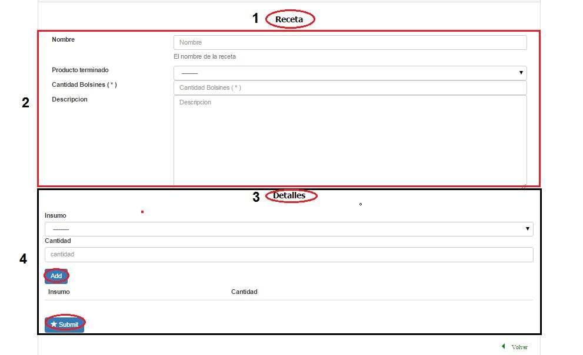

Alta Receta
====================================

(1) Nombre de la sección en la que nos ubicamos, (2) descripción de la receta a crear, (3 y 4) el detalle de la receta a crear, agregar un insumo y su cantidad a la receta,  debajo se encuentra el botón de guardar.

Observaciones:
-------------
	No se podrá dar de alta una receta que tenga el mismo nombre que otra que ya exista.
	No se podrá dar de alta una receta que contenga un mismo producto terminado de otra receta.