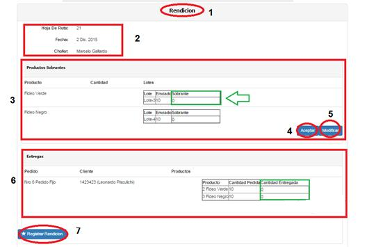

Rendición de Reparto
====================================

En (1) vemos la sección donde nos encontramos, en este caso, nos encontramos en “Rendición”. En (2) vemos el número, la fecha de generación y el chofer asignado de la Hoja de Ruta. 
En la sección (3) vemos el Listado de Productos Sobrantes, donde se deberá ingresar, para cada producto terminado, los sobrantes del reparto. Si no hubo sobrantes, por defecto dicha grilla tendrá el valor cero para cada producto terminado. El botón (4) que dice “aceptar” permite confirmar el registro de productos sobrantes, mientras que el botón (5) que dice “modificar”, permite modificar dicha confirmación. 
En la sección (6) vemos una grilla llamada “Entregas”, donde se deberá ingresar para cada producto de cada pedido de cada cliente, la cantidad de bolsines entregados. Finalmente, presionando el botón (9) se registrará finalmente la rendición de la hoja de ruta.

*	Observaciones:
	No se podrá registrar la rendición de productos extras que sea mayor a la cantidad de productos registrados en la hoja de ruta.
	Si se detecta que las cantidades ingresadas no “cierran” o si se ingresaron datos incorrectos, saldrán mensajes de error indicando donde se produjo el problema.

Rendición de Pagos
---------------------------------------

En (1) podemos ver la Hoja de Ruta a la que queremos hacerle la rendición de cobros.
En (2) vemos un mensaje de confirmación, en el cual se nos indica el estado de la rendición de la Hoja de Ruta.
En (3) vamos a ver una Grilla por cada Cliente y sus pedidos que estaban asociados a la Hoja de ruta, mostrándose el nombre del cliente, y el listado de cada producto pedido (medido en bolsines), la cantidad pedida, la cantidad entregada y el precio total.
En el ítem (4) tenemos el formulario de pago, en donde se deberá ingresar el monto pagado por el usuario, y el número de recibo o factura asociado al pedido pagado. Se deberá ingresar el número de remito cuando el monto pagado sea menor al adeudado. En caso de que el cliente haya abonado la totalidad, se deberá ingresarse el número de factura. Es importante saber que podemos no ingresar ningún monto, lo que significaría que el cliente no realizó el pago de los pedidos. Si ingresamos un monto, deberemos presionar el botón (5) para registrar el pago.
Por último, una vez que se haya realizado la rendición de pagos de cada cliente, presionaremos el botón (6) y finalmente realizará la rendición de la hoja de ruta y la rendición de pagos.

