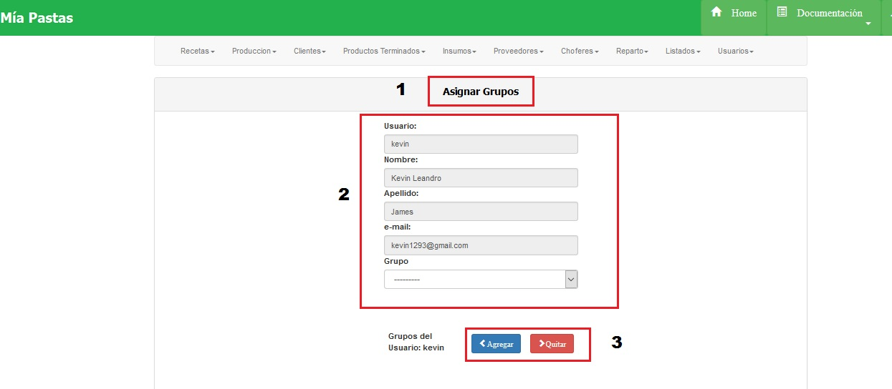

Asignar o modificar Grupo a Usuario
===================================

Para asignar un grupo a un usuario se deberá hacer click sobre la lista desplegable de GRUPO, selecciónar un grupo y hacer click en agregar. Para quitar un grupo se deberá seleccionar de la lista de grupos y hacer click en el boton quitar:

(1) Sección en la que nos encontramos, (2) Datos del usuario y lista desplegable de grupos, (3) botones de agregar o quitar grupos.

