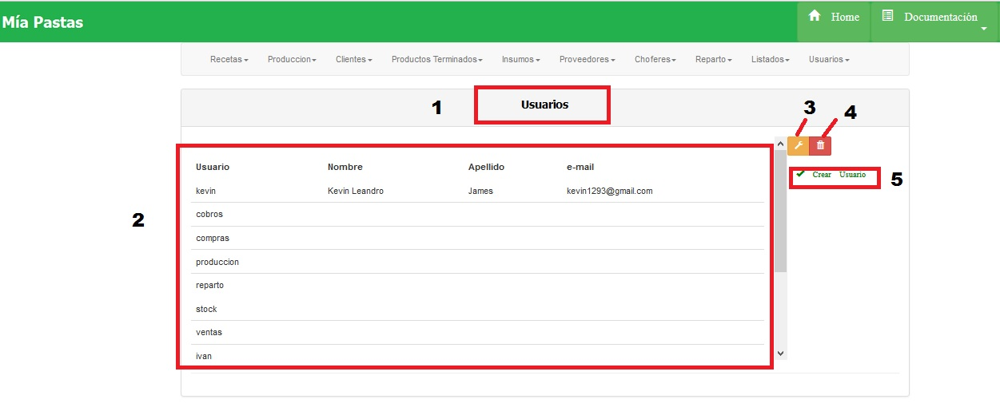
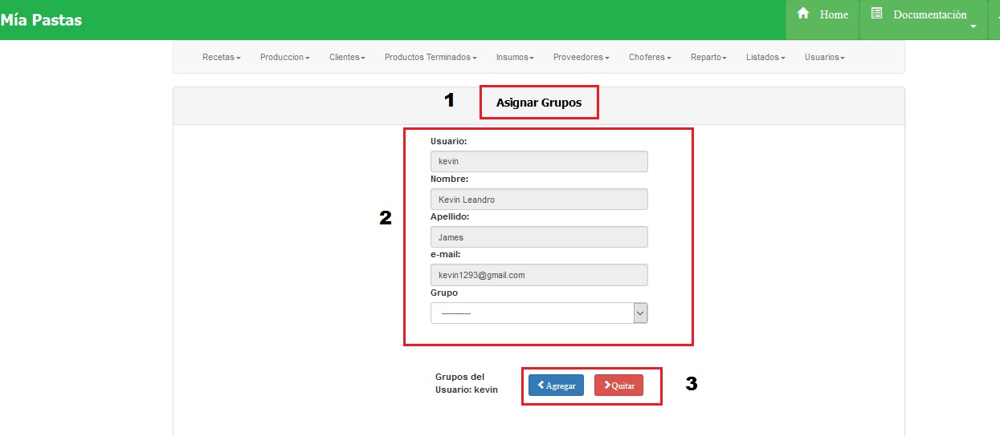
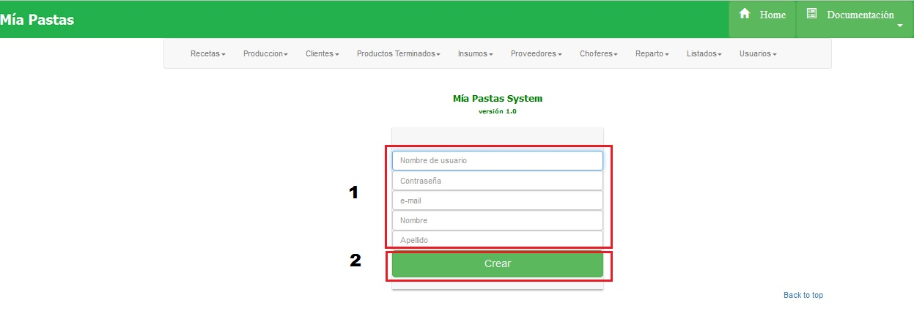

Administrar Usuario
====================================

Para administar los permisos del usuario, agregar un usuario y/o eliminar un usuario deberemos estar dentro de la sección administrar usuario, como se ve a continuación:

(1) Sección en la que nos encontramos, (2)se mostrará un listado de los nombres de los usuarios con sus datos, (3) el botón para agregar grupos o modificar los grupos de los usuarios, (4) el botón de eliminar usuarios, (5) permite crear un nuevo usuario.

Asignar o modificar Grupo a Usuario
-------------------------------

Para asignar un grupo a un usuario se deberá hacer click sobre la lista desplegable de GRUPO, selecciónar un grupo y hacer click en agregar. Para quitar un grupo se deberá seleccionar de la lista de grupos y hacer click en el boton quitar:

(1) Sección en la que nos encontramos, (2) Datos del usuario y lista desplegable de grupos, (3) botones de agregar o quitar grupos.

Crear Usuario
-------------------------------

(1) datos del usuario a agregar, (2) botón de alta

.. toctree::
   :maxdepth: 3

   usuarios admin
   singup

