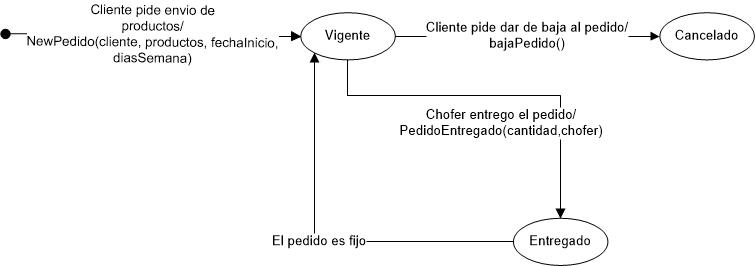

Proyecto
========

Objetivos
---------
Desarrollar un sistema de gestión para la fábrica de pastas MÍA PASTAS participando de un desarrollo ágil e introduciendo innovaciones tecnológicas en una arquitectura web, permitiéndonos la experiencia de trabajar en equipo.

Alcance del Sistema
-------------------
Este sistema realizará:
•	Gestión de recetas.
•	Gestión de productos
•	Gestión de producción.
•	Gestión de clientes.
•	Gestión choferes.
•	Gestión de proveedores.
•	Gestión de pedidos de clientes.
•	Gestión de insumos.
•	Gestión de pedidos a proveedores.
•	Gestión de zonas.
•	Gestión de ciudades.

Límites del Sistema
-------------------
En esta versión del  sistema no se manejará la gestión de vencimiento de insumos. 
Se asume que todos los pedidos a proveedores son recibidos correctamente, y no se contempla la gestión de reclamos por faltante o sobrante de productos del pedido. 
Tampoco manejara la facturación y pago a proveedores.
Cuando se reparten los pedidos solamente se podrán dejar productos de más a un cliente siempre y cuando se hayan cargados productos extras en la hoja de ruta que permitan cumplir con esas solicitudes no programadas.

Requisitos Funcionales
----------------------
Gestión de recetas

1.	Registrar receta.
2.	Modificar receta.
3.	Baja de receta.
4.	Consultar receta

Gestión de productos

5.	Alta producto
6.	Modificar producto
7.	Baja de producto
8.	Consultar productos

Gestión de producción

9.	Registrar producción.
10.	Consultar producciones.
11.	Generar listado de productos terminados disponibles.
12.	Decrementar stock de un producto terminado.
13.	Modificar precio de producto terminado.

Gestión de clientes

14.	Alta cliente.
15.	Modificar cliente.
16.	Consultar cliente.
17.	 Baja cliente.
18.	Consultar todos los clientes morosos. 
19.	Consultar Cuenta Corriente de un Cliente.
20.	Generar Listado de Cuenta Corriente.

Gestión de choferes

21.	 Alta chofer.
22.	 Modificar chofer.
23.	Baja chofer.
24.	Consultar choferes.

Gestión de proveedores

25.	 Alta proveedor.
26.	 Consulta proveedores.
27.	 Baja proveedor.
28.	 Modificar proveedor.

Gestión de Pedidos a proveedores

29.	 Realizar pedido a proveedor.
30.	 Modificar pedido de un proveedor.
31.	 Consultar pedidos pendientes de un proveedor.
32.	 Eliminar pedido pendiente a proveedor.
33.	 Recepción de pedido a proveedor.

Gestión de pedidos de clientes

34.	 Registrar pedido fijo para cliente fijo.
35.	 Registrar pedido ocasional para cliente ocasional.
36.	 Modificar productos del pedido de cliente.
37.	 Eliminar pedido cliente.
38.	 Consultar pedidos de un cliente.
39.	 Cobrar a cliente.
40.	 Registrar Rendición del Reparto.
41.	 Generar hoja de ruta.
42.	 Registrar pedido de cambio por productos vencidos.
43.	 Modificar fecha de entrega de un pedido ocasional.
44.	 Modificar periodicidad de entrega de un pedido fijo.
45.	Consultar productos a entregar en un período.

Gestión de insumos

46.	 Alta insumo.
47.	 Actualizar stock insumo.
48.	 Agregar insumo como comercializado por un proveedor.
49.	 Eliminar insumo a proveedor.
50.	 Generar listado de insumos disponibles.
51.	 Baja de insumo.

Gestión de zonas

52.	 Alta zona.
53.	 Baja zona.
54.	 Modificar zona.
55.	 Consultar zona.

Gestión de ciudades

56.	 Alta ciudad.
57.	 Baja ciudad.
58.	 Modificar ciudad.
59.	 Consultar ciudad.

Requisitos No Funcionales
-------------------------
•	Se va a hacer uso de una arquitectura cliente-servidor basada en tecnología Web, se creará una red de uso interno (intranet) en donde los clientes se conectarán al servidor central mediante un navegador web.
•	El lenguaje elegido para desarrollar la aplicación es Python versión 2.7.10 a través del Framework Django versión 1.8.3. 
•	La aplicación debe utilizar el Motor de Base de Datos relacional PostgreSQL versión 9.0.18.
•	Proveer diferentes perfiles de usuarios cada uno con distintos permisos para ejecutar las funcionalidades provistas por el sistema.
•	Debe contar con un manual de uso y ayuda en línea.
•	Debe utilizar el idioma español para los mensajes y textos de la interfaz.

Decisiones sobre la tecnología utilizada
----------------------------------------
El sistema nace como un pequeño sistema web interno (Intranet), donde cada usuario puede acceder desde una terminal remota al sistema. La idea a futuro es poder escalar el sistema con muy poco esfuerzo para que funcione en Internet, se podría así, por ejemplo, facilitar a los clientes realizar pedidos. 
También influyó en esta decisión los deseos del grupo de aprender a desarrollar aplicaciones bajo dicha tecnología, ya que las aplicaciones web son los sistemas de información con mayor demanda en la actualidad.
Se selecciona Django como framework que utiliza el lenguaje Python por la extensibilidad que provee para continuar escalando el software a futuro, si bien el sistema nace como un sistema de uso interno se empieza a percibir por parte del cliente la intenciones de publicarlo en Internet y esto hace que decidamos utilizar algo que escale rápido y bien. Características de Django:
•	Es un framework que respeta el patrón de diseño MVC. 
•	Cuenta con una aplicación administrativa que permite administrar varias páginas.
•	Provee un Mapeador Objeto-Relacional.
•	Provee una API de Bases de Datos robusta.
•	La meta principal de Django es facilitar la creación de sitios web complejos. 
•	Es muy usado actualmente.
•	Es de fácil aprendizaje.
•	Es versátil: lo que posibilita el desarrollo e implementación rápido de aplicaciones web escalables y seguras.
•	Posee licencia BSD: lo que otorga la libertad de distribuir y comercializar los productos desarrollados utilizando el mismo.
•	Tiene una amplia documentación Online.
El lenguaje Python posee una sintaxis simple, clara y sencilla, el tipado dinámico, la gran cantidad de bibliotecas disponibles, la facilidad de instalación en sistemas operativos tanto en Windows como Linux, la potencia del lenguaje (parecido al pseudocódigo) y la documentación disponible, entre otros, hacen que desarrollar una aplicación en Python sea sencillo y muy rápido.
Si bien SQLite ya viene incorporado con Django, hemos decidido utilizar el Motor de BD PostgreSQL por los siguientes motivos:
o	Nos provee manejo de concurrencia para los diferentes usuarios que harán uso de la aplicación.
o	Es de código abierto.
o	Es compatible con el framework.
o	Posee funcionalidades orientadas al resguardo y migración de datos más estables y seguras frente a las proporcionadas por SQLite, MySQL y los otros motores compatibles con Django. 

Perfiles de usuario
-------------------
•	Administrador: se encarga de la gestión de roles y permisos para los diferentes usuarios del sistema.
•	Encargado de Producción: se encarga de la gestión de las recetas, producto y producción.
•	Encargado de Ventas: se encarga de la gestión de clientes, gestión de pedidos a clientes, gestión de zonas y gestión de ciudades.
•	Encargado de Compras: se encarga de la gestión de proveedores, gestión de insumos y gestión de pedidos a proveedores.
•	Encargado de reparto: se encarga de la gestión de choferes.
•	Encargado de Cobros: se encarga de consultar todos los clientes morosos, consultar cuenta corriente de un cliente, generar listado de cuenta corriente y cobrar a cliente.
•	Encargado de Stock: se encarga de decrementar stock de producto terminado, consultar stock de producto terminado, Registrar rendición de reparto, generar hoja de ruta, consultar productos a entregar en un período, actualizar stock de insumo, baja de insumo, consultar stock de insumos en un período y recepción de pedido a proveedor.

Modelo ER
------------------
.. image:: _static/DocuProyecto/modeloER.jpeg

Diagrama de clases
------------------
.. image:: _static/DocuProyecto/DIAGRAMAClases.jpg

Diagrama de estados de pedido
------------------

